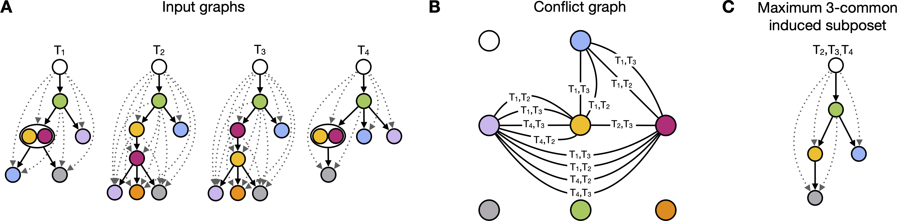

# POTTR

POsets for Temporal Trajectory Resolution (POTTR) is a combinatorial method to identify maximum recurrent trajectories in biological processes described by sequences of events with a temporal ordering.
POTTR models these processes, such as tumor formation or cell differentiation, as incomplete posets.
A recurrent trajectory is a set of events, like mutations, that follow the same incomplete partial order across distinct incomplete posets.

We model conflicting orders between shared events in a conflict graph.
POTTR identifies maximum independent sets in subgraphs of the conflict graph, which directly corresponds to a maximum recurrent trajectory shared in a subset of the input.
Since the input data might be very heterogeneous, POTTR searches for recurrent trajectories that are shared in at least $k$ incomplete posets.


<p align="center">
  
</p>


## Setup

### Conda
The easiest way to get POTTR running is by using [a conda distribution like miniconda](https://docs.conda.io/projects/conda/en/latest/user-guide/install/index.html).

After setting up conda (installation + initialization for your shell), create a new environment with the provided `environment.yaml` which contains the required dependencies for POTTR.

In the [Code](Code/) directory execute:

```shell
conda env create -f environment.yaml
conda activate pottr_env
```

### Gurobi
POTTR uses the Gurobi solver for which a license is required. Further information can be found [here](https://www.gurobi.com/academia/academic-program-and-licenses/). 

## Data

### MASTRO comparison
We provide tumor trees of 89 NSCLC and 120 AML patients in the [data/data_mastro](data/data_mastro) directory, which we originally obtained from [MASTRO](https://github.com/VandinLab/MASTRO/tree/main) \[1\].

### TRACERx data
The phylogenetic trees from TRACERx are available at [zenodo](https://zenodo.org/record/7822002).
Download and unpack the zip file from zenodo first. Then follow the instructions in [here](data/TRACERx%20preprocessing/README.md) to create the phylogenetic trees for the execution with POTTR.

### Cell differentiation data
We provide cell differentiation maps generated with [Carta](https://github.com/raphael-group/CARTA) \[2\] in the [data/data_carta](data/data_carta) directory in graph exchange XML format, which can be read in by POTTR directly. 

## Execution

In the [code](Code/) directory, run POTTR via the `./run_POTTR.py` Python script.

### Program arguments

The following arguments are available:

| Argument          | Argument long form               | Description                                                                              |
|-------------------|----------------------------------|------------------------------------------------------------------------------------------|
| -h                | --help                           | show help message and exit                                                               |
| -o <path>         | --output-path <path>             | Path to store output files                                                               |
| -d <dags>         | --dags <dags>                    | File or directory containing transitively closed DAGs (incomplete posets)                |
| -k <k>            | --k <k>                          | Number k of incomplete posets to search for common trajectory                            |
| -c <cores>        | --cores <cores>                  | Number cores / threads Gurobi should use; default 0, Gurobi will use all available cores |
| -parallel         | --parallelize                    | Enable parallel processing for creating conflict graph                                   |
| -pool <pool size> | --solution-pool-size <pool size> | Solution pool size for Gurobi to retrieve multiple solutions                             |
| -v                | --verbose                        | Increase output verbosity                                                                |
| -dots             | --draw_dots                      | Create trajectory png files (only recommended for small instances)                       |


### Example execution with test data

In the [Code](Code/) directory execute:

```shell
python run_POTTR.py --dags ../Data/test_data/ --output-path ../Data/output -k 3 -v
```

### Program ouput
```
output
├── converted_graphs.txt -- identified maximum recurrent trajectories and all input DAGs supporting each trajectory
├── number_of_distinct_dags_per_sample.csv -- overview of distinct DAGs per sample read from the input
├── processed_graphs
│   └── processed_graphs_support.csv
├── significance_output.txt -- statistical significance values of maximum recurrent trajectories
└── trajectories_gexf
    ├── 0_trajectory.gexf -- maximum recurrent trajectory identified by POTTR
    └── traj_graphs_names.csv -- matching between trajectories and supporting input DAGs

```

### References
1. Leonardo Pellegrina, Fabio Vandin, Discovering significant evolutionary trajectories in cancer phylogenies, Bioinformatics, Volume 38, Issue Supplement_2, September 2022, Pages ii49–ii55, https://doi.org/10.1093/bioinformatics/btac467
2. Palash Sashittal, et al., Inferring cell differentiation maps from lineage tracing data, International Conference on Research in Computational Molecular Biology, Cham: Springer Nature Switzerland, 2025, https://doi.org/10.1007/978-3-031-90252-9_29